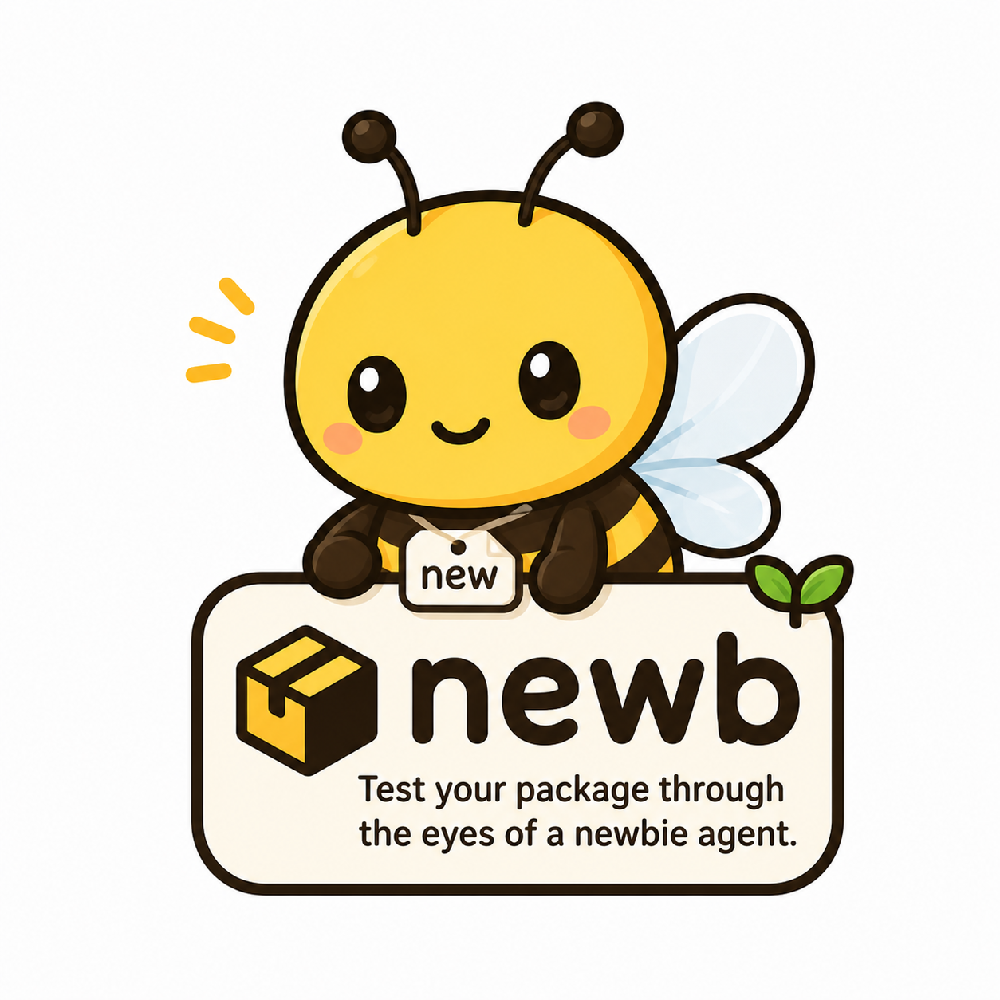

# newb

<p align="center"></p>

A fresh AI agent reads only your `_skills/` (or equivalent docs) and tries
to use your package. If it succeeds, your docs work.

## Install

```bash
pip install newb
```

## Use

```bash
newb ./src/mypkg/_skills/mypkg
newb ./_skills --format markdown >> README.md
```

Spins up a clean docker container with **only your skills** mounted, then
asks a fresh Claude agent four canonical questions (what for / problems /
quick start / when not to use), plus optional red tests from
`_red_tests.yaml`.

Output: JSON (for CI) or markdown (for README injection).

## Library

```python
import newb
report = newb("./src/mypkg/_skills/mypkg")
print(newb.render_markdown(report))
```

## Requirements

- Docker on PATH
- `ANTHROPIC_API_KEY` in env
- Python 3.10+

## License

AGPL-3.0-only.
